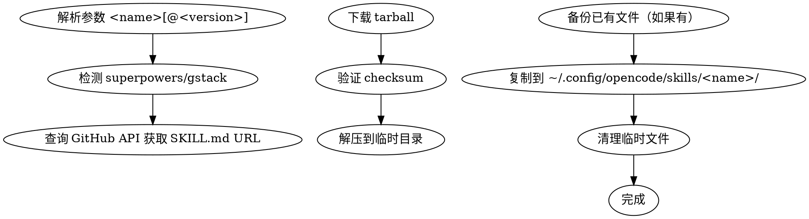
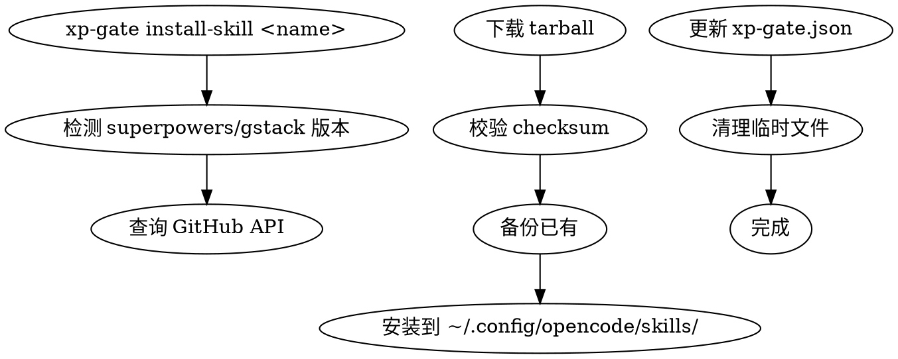
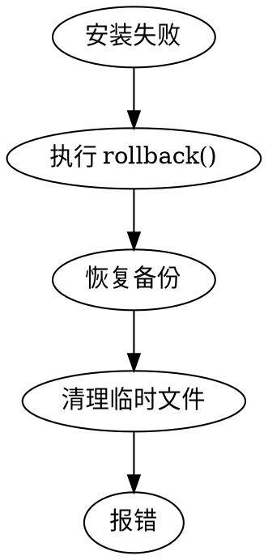

# XP-Gate Zero-Install Design: npm + 按需安装架构

**Date**: 2026-05-19
**Status**: v2.0 (Round 1 修复后)
**Author**: Sisyphus
**Changelog**: v2.0 增加错误处理、版本管理、install-skill 细节、离线方案、npm 发布配置

## Context

当前 XP-Gate 的安装方式需要 `git clone` 仓库，无法满足 AI agents 的"零安装"需求。用户希望参考 Andrej Karpathy 的 llm-wiki 模式，让 XP-Gate 对 AI Agent 更友好。

Andrej Karpathy 的 llm-wiki 使用 MCP (Model Context Protocol) 架构：
- MCP Server 预装在本地
- AI agent 通过配置自动发现 tools
- 无需 `git clone` 或显式安装命令

## 目标

XP-Gate 支持"零 clone"安装，AI agents 可以：
1. `npm install -g xp-gate` 一条命令安装核心（hooks + CLI）
2. `xp-gate install-skill <name>` 按需安装 Skills
3. 能访问 GitHub 即可安装（通过 `github:your-org/xp-gate`）

## 设计决策

### 决策 1：分发方式 - 按需安装 (Option B)

| 决策 | 选择 |
|-------|------|
| **方案** | npm global 包 + 子命令按需下载 Skills |
| **理由** | 体积小、灵活、不浪费存储 |

#### 包结构

| 包名 | 内容 | 安装源 |
|------|------|--------|
| `xp-gate` | 质量门禁核心：hooks + adapters + install-skill 子命令 | GitHub + npm |
| `xp-gate-skill-sprint-flow` | Sprint Flow SKILL.md | GitHub |
| `xp-gate-skill-delphi-review` | Delphi Review SKILL.md | GitHub |
| `xp-gate-skill-test-spec` | Test-Spec Alignment SKILL.md | GitHub |
| `xp-gate-skill-ralph-loop` | Ralph Loop SKILL.md | GitHub |

#### 安装流程

```bash
# 1. 安装核心（hooks + CLI）
npm install -g xp-gate

# 2. 初始化项目（交互式）
xp-gate init                    # 引导用户配置

# 3. 按需安装 Skill
xp-gate install-skill sprint-flow    # 从 GitHub 下载 SKILL.md
xp-gate install-skill delphi-review
xp-gate install-skill test-spec
xp-gate install-skill ralph-loop

# 4. 更新 Skill
xp-gate update-skill sprint-flow      # 更新到最新版本

# 5. 卸载 Skill
xp-gate uninstall-skill sprint-flow  # 移除 Skill
```

### 决策 2：目录结构

```
xp-gate/
├── package.json              # npm 包配置，包含 bin/ 入口
├── bin/
│   └── xp-gate.js            # CLI 入口（shebang: #!/usr/bin/env node）
├── hooks/
│   ├── pre-commit          # Git hooks（可执行）
│   ├── pre-push
│   └── adapter-common.sh
├── adapters/
│   ├── typescript.sh
│   ├── python.sh
│   └── ... (13个语言 adapters)
├── lib/
│   ├── init.js             # xp-gate init 实现
│   ├── install-skill.js    # xp-gate install-skill 子命令
│   ├── update-skill.js    # xp-gate update-skill 子命令
│   ├── uninstall-skill.js # xp-gate uninstall-skill 子命令
│   ├── detect-deps.js     # 依赖检测（含版本兼容）
│   ├── download-skill.js  # GitHub 下载（支持 tarball）
│   ├── rollback.js        # 安装失败回滚
│   └── config.js          # 配置文件读写
├── config/
│   └── xp-gate.json         # 配置文件
└── SKILL.md              # Skill 自描述（用于 xp-gate-skill-xxx 包）
```

### 决策 3：Git Hooks 安装位置

| 位置 | 说明 |
|------|------|
| **项目本地** | `$(git rev-parse --show-toplevel)/.git/hooks/` |
| **OpenCode 全局模板** | `~/.config/opencode/git-hooks-template/` |

### 决策 4：npm Registry

| 决策 | 选择 |
|-------|------|
| **Registry** | GitHub Packages（推荐）+ npm public |
| **包地址** | `github:boyingliu01/xp-gate` (npm install) |
| **发布流程** | `npm version patch && npm publish` |

**发布配置（package.json）**：

```json
{
  "name": "xp-gate",
  "version": "1.0.0",
  "bin": {
    "xp-gate": "./bin/xp-gate.js"
  },
  "files": [
    "bin/",
    "hooks/",
    "adapters/",
    "lib/"
  ],
  "repository": {
    "type": "git",
    "url": "https://github.com/boyingliu01/xp-gate"
  },
  "publishConfig": {
    "registry": "https://npm.pkg.github.com"
  }
}
```

### 决策 5：版本管理

| 组件 | 版本策略 |
|------|--------|
| **xp-gate 核心包** | semver（主版本锁定）|
| **Skills** | semver + Git tag |
| **兼容性** | xp-gate@1.x.x 兼容 skills@1.x.x |
| **版本锁定** | `xp-gate install-skill sprint-flow@1.0.0` 安装指定版本 |

**版本兼容性矩阵**：

| xp-gate 版本 | 兼容 Skills 版本 |
|-----------|-----------------|
| 1.0.x | 1.0.x |
| 1.1.x | 1.0.x, 1.1.x |
| 2.0.x | 2.0.x（breaking）|

### 决策 6：依赖处理

XP-Gate Skills 依赖 superpowers 和 gstack。

**检测时机**：安装 xp-gate 核心时检测一次，不是每次安装 Skill 时重复检测。

| 步骤 | 动作 |
|------|------|
| 1 | `xp-gate init` 检测 superpowers/gstack 版本 |
| 2 | 不存在 → 警告并提示安装（不阻断） |
| 3 | 版本不兼容 → 报错并提示最小版本 |
| 4 | 存在且兼容 → 标记为"已验证" |

**版本检测逻辑**（lib/detect-deps.js）：

```javascript
function checkDeps() {
  const deps = [
    { name: 'superpowers', minVersion: '1.0.0' },
    { name: 'gstack', minVersion: '1.0.0' }
  ];
  for (const dep of deps) {
    const installed = findSkill(dep.name);
    if (!installed) {
      return { ok: false, missing: dep.name };
    }
    if (semver.lt(installed.version, dep.minVersion)) {
      return { ok: false, versionMismatch: dep.name, required: dep.minVersion, found: installed.version };
    }
  }
  return { ok: true };
}
```

**错误提示**：

```bash
$ xp-gate init
⚠️  检测到缺少依赖：
  • superpowers (需要 >= 1.0.0)
  • gstack (需要 >= 1.0.0)
请先安装：
  npm install -g @superpowers/sprint-flow
  参考：https://github.com/your-org/superpowers
```

### 决策 7：install-skill 实现细节

**安装流程**（lib/install-skill.js）：



**下载机制**：

```bash
# 使用 GitHub API 获取 tarball URL
curl -fsSL "https://api.github.com/repos/boyingliu01/xp-gate/tarball/ref" -o skill.tgz

# 验证 checksum
sha256sum skill.tgz

# 解压到目标目录
tar -xzf skill.tgz -C ~/.config/opencode/skills/<name>/ --strip-components=1
```

**版本指定**：

```bash
xp-gate install-skill sprint-flow        # 安装最新版本
xp-gate install-skill sprint-flow@1.0.0 # 安装指定版本
xp-gate install-skill sprint-flow@latest # 安装最新版本
```

### 决策 8：错误处理与回滚

**错误场景与处理**：

| 错误场景 | 处理方式 |
|---------|---------|
| GitHub 访问失败 | 重试 3 次 → 报错提示检查网络 |
| 下载文件损坏 | checksum 校验失败 → 删除并报错 |
| 目标目录已有文件 | 备份原有文件 → 安装新版本 → 失败则回滚 |
| 权限不足 | 报错提示 `sudo` 或检查目录权限 |
| 磁盘空间不足 | 检测可用空间 → 报错 |

**回滚机制**（lib/rollback.js）：

```javascript
async function rollback(installId) {
  const backupDir = `~/.config/xp-gate/backup/${installId}/`;
  if (fs.existsSync(backupDir)) {
    // 恢复备份文件
    copyRecursive(backupDir, targetDir);
    // 清理备份
    fs.rmSync(backupDir, { recursive: true });
  }
}
```

**安装失败输出**：

```bash
$ xp-gate install-skill sprint-flow
✓ 检测 superpowers 依赖... 已安装
✓ 检测 gstack 依赖... 已安装
✗ 下载失败：网络超时
  重试 1/3...
  重试 2/3...
✗ 下载失败：超过最大重试次数
  请检查网络连接，或尝试：
    xp-gate install-skill sprint-flow --offline  # 使用缓存
    xp-gate install-skill sprint-flow --verbose  # 查看详细日志
```

### 决策 9：离线安装方案

| 场景 | 支持方式 |
|------|---------|
| **核心包** | npm install 时缓存，后续离线可用 |
| **Skills** | `xp-gate install-skill --offline` 使用本地缓存 |
| **缓存位置** | `~/.config/xp-gate/cache/` |
| **更新缓存** | `xp-gate cache-update` |

```bash
# 安装时自动缓存
xp-gate install-skill sprint-flow  # 同时缓存到 ~/.config/xp-gate/cache/

# 离线安装
xp-gate install-skill sprint-flow --offline  # 使用缓存，无网络可用
```

### 决策 10：更新与卸载

**更新机制**：

```bash
# 更新单个 Skill
xp-gate update-skill sprint-flow

# 更新所有 Skills
xp-gate update-skill --all

# 更新到指定版本
xp-gate update-skill sprint-flow@1.1.0
```

**卸载机制**：

```bash
# 卸载单个 Skill
xp-gate uninstall-skill sprint-flow

# 确认卸载
xp-gate uninstall-skill sprint-flow --force
```

**配置文件**（~/.config/xp-gate/xp-gate.json）：

```json
{
  "version": "1.0.0",
  "installedSkills": {
    "sprint-flow": { "version": "1.0.0", "installedAt": "2026-05-19" },
    "delphi-review": { "version": "1.0.0", "installedAt": "2026-05-19" }
  },
  "cacheDir": "~/.config/xp-gate/cache/"
}
```

## 数据流

### 安装核心流程


### 安装 Skill 流程



### 错误回滚流程



## 测试策略

| 测试类型 | 说明 | 工具 |
|--------|------|------|
| **安装测试** | `npm install -g xp-gate` 在干净环境 | 测试脚本 |
| **Skill 安装测试** | `xp-gate install-skill sprint-flow` 并验证文件存在 | 测试脚本 |
| **版本检测测试** | superpowers/gstack 缺失或不兼容时报错 | Mock |
| **错误处理测试** | 网络超时、权限不足等场景 | Mock |
| **回滚测试** | 安装失败后验证回滚 | Mock |
| **离线测试** | `xp-gate install-skill --offline` | Mock |
| **功能测试** | hooks 在 git commit 时正确触发 | bash + git |
| **E2E 测试** | 完整安装 → 使用 → 卸载流程 | script |

## 风险与缓解

| 风险 | 缓解 |
|------|------|
| superpowers/gstack 依赖版本冲突 | 安装时检测 + semver 版本锁定 |
| GitHub 访问限制 | 企业内网可搭建 GitHub Enterprise mirror |
| 离线安装 | 缓存机制 + `xp-gate cache-update` |
| 安装失败 | 回滚机制确保干净状态 |
| 版本不一致 | semver + 配置文件锁定版本 |

## 下一步

- [x] delphi-review Round 1 评审（REQUEST_CHANGES → 修复）
- [ ] delphi-review Round 2 评审
- [ ] 实现 npm 包结构
- [ ] 实现 CLI 命令
- [ ] 实现 install-skill 子命令
- [ ] 实现 update-skill 子命令
- [ ] 实现 uninstall-skill 子命令
- [ ] 实现 rollback 机制
- [ ] 实现缓存机制
- [ ] 发布到 GitHub Packages
- [ ] UAT 测试

## 参考

- [llm-wiki MCP 架构](https://github.com/boyingliu01/llm-wiki)
- [xp-gate 当前安装脚本](../scripts/install-all.sh)
- [xp-gate skills](../skills/)
- [npm semver](https://semver.org/)